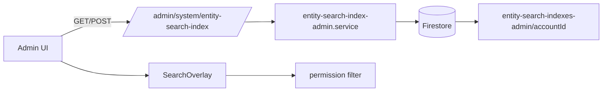

# Plan tecnico: Global Search Admin (paridad con Web)

## Objetivo

Implementar en `dp-proj-00-02-admin` una busqueda global equivalente a Web en UX y capacidades:

- Apertura por `Ctrl/Cmd + K`
- Overlay con resultados de:
  - Navegacion
  - Acciones rapidas
  - Registros (entidades indexadas)
- Filtro por permisos efectivos
- Boton de limpiar input
- Boton de regenerar indices
- Integracion backend-first (sin lectura Firestore directa desde el cliente)

---

## Alcance de paridad

### Incluido

1. **Frontend Admin**
   - Trigger + overlay + hook composable (`useGlobalSearch`)
   - Historial local por usuario/admin account
   - Filtro de resultados por permisos admin
   - Rebuild manual de indices desde UI

2. **Backend**
   - Endpoints admin:
     - `GET /admin/system/entity-search-index`
     - `POST /admin/system/entity-search-index/rebuild`
   - Servicio indexador incremental para entidades admin
   - Rebuild completo por account

3. **Modelo de indice**
   - Documento agregador por account:
     - `entity-search-indexes-admin/{accountId}`

### Excluido (fase posterior)

- Ranking avanzado (scoring ponderado, typo-tolerance)
- Busqueda federada multi-account para superadmin global
- Telemetria de clicks / analitica avanzada

---

## Arquitectura propuesta



### Principio clave

Mantener la misma estrategia de Web:

- El cliente **no** consulta colecciones de negocio para buscar.
- El cliente consume un **indice materializado** preparado por backend.

---

## Modelo de datos (admin)

Coleccion:

- `entity-search-indexes-admin/{accountId}`

Estructura sugerida:

```ts
{
  accountId: string,
  updatedAt: Timestamp | null,
  entities: {
    account?: Record<id, { fields, fieldsNormalized }>,
    company?: Record<id, { fields, fieldsNormalized }>,
    admin-user?: Record<id, { fields, fieldsNormalized }>,
    subscription?: Record<id, { fields, fieldsNormalized }>,
    plan?: Record<id, { fields, fieldsNormalized }>,
    role?: Record<id, { fields, fieldsNormalized }>
  }
}
```

Reglas:

- `fields`: valores legibles para mostrar
- `fieldsNormalized`: lower + sin tildes para matching rapido en frontend
- Sin arrays gigantes anidados por entidad fuera de este documento (mantener simplicidad/paridad con Web)

---

## Entidades admin a indexar (v1)

1. `account`
   - `name`, `status`
2. `company`
   - `name`, `ruc`, `status`
3. `admin-user`
   - `displayName`, `email`, `status`
4. `subscription`
   - `planId`, `status`
5. `plan`
   - `name`, `code`/`id`
6. `role`
   - `name`, `description`

> Nota: ajustar nombres reales segun los DTOs/campos actuales en backend admin.

---

## Backend: plan de implementacion

## 1) Nuevo servicio de indice admin

Archivo sugerido:

- `dp-proj-00-02-backend/src/features/search/entity-search-index-admin.service.ts`

Funciones:

- `normalizeFieldsForIndex(fields)`
- `updateAdminEntitySearchIndex(db, { accountId, entityId, action, recordId, fields })`
- `rebuildAdminEntitySearchIndexForAccount(db, { accountId })`

Consideraciones:

- `set(..., { merge: true })` para upsert incremental
- `FieldValue.delete()` para delete puntual
- Rebuild hace overwrite completo (`merge: false`) para dejar indice consistente

## 2) Endpoints admin

Agregar en router admin:

- `GET /admin/system/entity-search-index?accountId=...`
  - Validar acceso admin a ese account
  - Responder `{ accountId, updatedAt, entities }`
- `POST /admin/system/entity-search-index/rebuild?accountId=...`
  - Rebuild completo
  - Responder resumen por entidad (`{ ok, summary }`)

## 3) Hooks incrementales en CRUD admin

En cada ruta CRUD de entidades admin incluidas:

- `create` -> `updateAdminEntitySearchIndex(... action: "create")`
- `update` -> `... action: "update"`
- `delete` -> `... action: "delete"`

Ejecucion recomendada:

- Fire-and-forget con `.catch()` para no bloquear respuesta funcional principal
- Logs claros por entidad (`[admin/entity-search-index] ...`)

## 4) Seguridad

- Reutilizar validaciones de membresia/rol admin existentes
- No depender de Firestore rules para este flujo (backend Admin SDK)

---

## Frontend Admin: plan de implementacion

## 1) Crear feature global-search en admin

Ruta sugerida:

- `dp-proj-00-02-admin/app/features/global-search/`

Archivos:

- `global-search.types.ts`
- `search-registry.ts`
- `search-index.service.ts`
- `entity-search.service.ts`
- `search-history.service.ts`
- `useGlobalSearch.ts`
- `SearchTrigger.tsx`
- `SearchOverlay.tsx`
- `index.ts`

## 2) Integrar en `Dashboard.tsx`

Reemplazar input decorativo actual por:

- `SearchTrigger` en header
- `SearchOverlay` al final del layout

Comportamientos:

- `Ctrl/Cmd + K` abre/cierra
- `Esc` cierra
- Boton clear input
- Boton refresh indice
- Ocultar boton flotante de menu al abrir overlay (paridad visual con Web)

## 3) Servicio frontend para indice admin

En `entity-search.service.ts`:

- `GET /admin/system/entity-search-index`
- polling suave (30s) o solo fetch on-open + refresh manual
- `rebuildEntitySearchIndex(accountId)` via `POST /rebuild`

## 4) Registro de busqueda (admin)

`search-registry.ts` debe mapear:

- Entradas de menu admin (`app/data/menu.json`)
- Quick actions relevantes (crear account/company/user/etc.)
- Entity configs con:
  - `entityId`
  - `detailPath` valido en admin
  - icono
  - permiso requerido

## 5) Filtro de permisos

Usar utilidades admin existentes (`accessService` / `permission-codes`) y replicar criterio de Web:

- Navegacion: `canNavigateToModule(...)`
- Acciones y entidades: chequeo por modulo/accion

---

## Compatibilidad y migracion

1. Feature flag opcional:
   - `VITE_ENABLE_ADMIN_GLOBAL_SEARCH=true`
2. Si flag off:
   - mantener input actual sin comportamiento
3. Si flag on:
   - activar trigger + overlay

No requiere migracion de datos compleja:

- El indice admin se crea/actualiza incrementalmente
- Rebuild manual cubre historicos

---

## Pruebas recomendadas

## Backend

1. `GET /admin/system/entity-search-index`:
   - con indice existente
   - sin indice (retorna vacio estructurado)
2. `POST /rebuild`:
   - genera counts correctos por entidad
3. Hooks CRUD:
   - create/update/delete actualizan paths correctos

## Frontend

1. Apertura/cierre overlay por teclado y click
2. Busqueda por codigo/nombre/email en entidades
3. Filtro por permisos (usuario con permiso parcial)
4. Boton clear limpia input y resultados
5. Boton refresh regenera y refresca resultados
6. No warning React keys duplicadas

---

## Riesgos y mitigaciones

1. **Doc indice demasiado grande**
   - Mitigar con limites por entidad o sharding en fase 2
2. **Inconsistencia temporal tras CRUD**
   - Fire-and-forget puede atrasar indice unos ms/seg
   - Mitigar con boton rebuild
3. **Rutas detailPath invalidas**
   - Validar contra `app/routes.ts`
4. **Permisos divergentes Web/Admin**
   - Centralizar chequeo en util comunes admin

---

## Checklist de entrega

- [ ] Servicio `entity-search-index-admin.service.ts`
- [ ] Endpoints admin `GET/POST` de indice
- [ ] Hooks en CRUD admin (entidades v1)
- [ ] Feature `app/features/global-search/*` en admin
- [ ] Integracion en `app/routes/Dashboard.tsx`
- [ ] Botones clear + refresh en overlay
- [ ] Ajuste visual z-index menu flotante al abrir overlay
- [ ] Pruebas manuales e2e
- [ ] Documentar en `dp-proj-00-02-admin/AGENTS.md` (seccion global search)

---

## Orden sugerido de ejecucion (1 PR)

1. Backend indice admin + endpoints
2. Frontend feature global-search admin
3. Integracion Dashboard admin
4. Hooks CRUD admin (indice incremental)
5. QA + hardening (keys, permisos, rutas)

